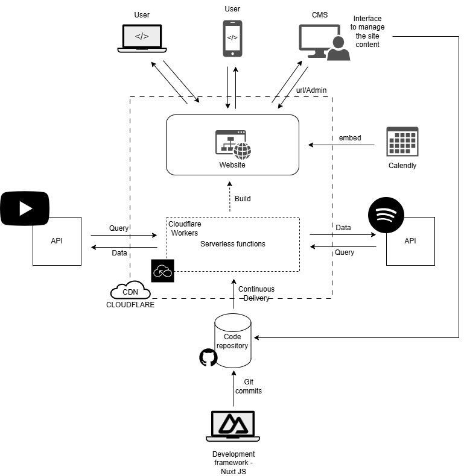

# Education Form All

Project space and repository for the website Education For All

## Requirements Gathered

There are multiple objectives for this website.

1. The primary objective is to provide education content (YouTube videos and Podcasts) to the users (mostly students) in a structured way.
2. The website also has a section for organizations which gives them information about the types of trainings Ankit can provide to their organization, show feedback of previous work and allow them to get in touch with Ankit within this section.
3. The website also serves as a portfolio for Ankit and showcases his achievements and publications.
4. Users both student and corporate can also provide feedback about the material in the website .
5. Ankit also wants to provide updates about his tours on this website and allow users to make appointment to meet him via his Calendly calendar.

### A structure of the site

Provided by Ankit and Richa

### Initial Wireframes

Madan developed initial wireframes of the site to visualize the UI/UX of the website

## Initial System Architecture Diagram

### Development framework - [Nuxt JS](https://nuxt.com/)

Nuxt JS is a frontend framework to build modern websites.

### [Decap CMS](https://decapcms.org/)

A content management system is a way to update the content of the site securely. Decap CMS will be coupled with the website and the GitHub repository to update the content.

### GitHub

Source code repository and project space to maintain all information about the site. The repository is public at the moment as this allows us to view this space without creating an account for all and also allows us to host the site which is great for demos during the development phase.

### [Cloudflare Pages](https://pages.cloudflare.com/)

Cloudflare pages has a free tier where we can host the site for free without any limits on number of requests. The limitations they have for free tier are the number of builds we can do per month (500 builds) and for a small site like ours their limit should be more than enough.

Cloudflare being a global CDN, users will be able to access our site quickly from anywhere in the world. And since our site is static it is even better for delivery speeds and SEO.

Our website will be built using the latest [Jamstack](https://jamstack.org/) architecture and above mentioned components form the core of the architecture and all we need to build and deploy the website.

As for buying the domain name and emails [Namecheap](https://www.namecheap.com/) is one site which we may not commonly know of but the pricing looks very competitive. Request you to search for "domain name providers" and decide on one that suits your needs.

## Development plan and Timeline

(TBD...)
