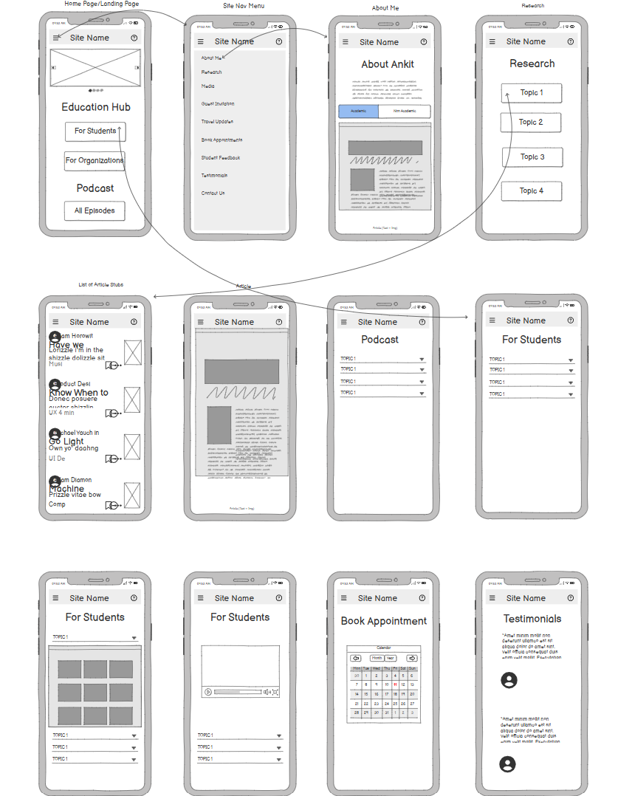

# EducationForAll
Project space and repository for the website Education For All

## Requirements Gathered
There are multiple objectives for this website.

1. The primary objective is to provide education content (YouTube videos and Podcasts) to the users (mostly students) in a structured way.
2. The website also has a section for organizations which gives them information about the types of trainings Ankit can provide to their organization, show feedback of previous work and allow them to get in touch with Ankit within this section.
3. The website also serves as a portfolio for Ankit and showcases his achievements and publications.
4. Users both student and corporate can also provide feedback about the material in the website .
5. Ankit also wants to provide updates about his tours on this website and allow users to make appointment to meet him via his Calendly calendar.

### A structure of the site

Provided by Ankita and Richa

### Initial Wireframes

Madan developed initial wireframes of the site to visualize the UI/UX of the website

## Initial System Architecture Diagram

